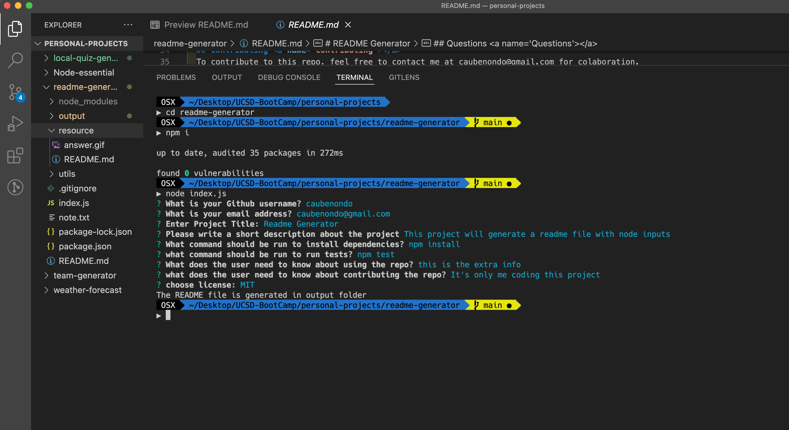

# README Generator

[](https://opensource.org/licenses/MIT)

## Description

This is a program will automatically generate a high-quality README for your app. All you need to do is answering a series of questions.

## Table of Contents

-   [Installation](#Installation)
-   [Get Started](#Starting)
-   [Usage](#Usage)
-   [License](#License)
-   [Contributing](#Contributing)
-   [Demo](#Example)
-   [Questions](#Questions)

## Installation <a name='Installation'></a>

To install necessary dependencies, run the following command:

```
  npm install
```

## Starting <a name='Starting'></a>

To start the program, run this command:

```
node index.js
```

## Usage <a name='Usage'></a>

You can quickly and easily create a README file by using command-line application to generate a high-quality one. This allows the project creator to devote more time to work on project.

## License <a name='License'></a>

The project is under [MIT](https://opensource.org/licenses/MIT) license.

## Contributing <a name='Contributing'></a>

To contribute to this repo, feel free to contact me at caubenondo@gmail.com for colaboration.

## Demo <a name='Example'></a>

You can review the [DEMO README FILE](https://github.com/caubenondo/readme-generator/blob/main/output/readme.md) or see below for app in action.
[](https://www.youtube.com/watch?v=4OBO_FPZVj0&ab_channel=HaiDuong)

## Questions <a name='Questions'></a>

If you have any questions about the repo, open an issue or contact me directly at caubenondo@gmail.com.
You can find more of my work at [caubenondo](https://github.com/caubenondo)
